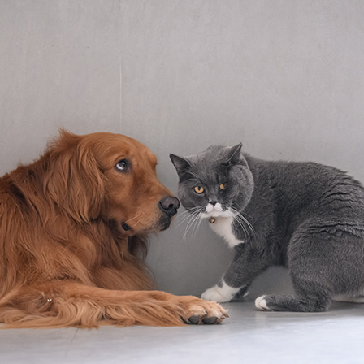

## Introduction
At this point, I don't need to tell you about AI. Personally I'm in favour of some of its applications (what a surprise, since my job depends on it), but hate the idea of any corporation getting my data for training or inference. One such way of preventing this is running your models in your own device. This helps preventing any user data leaving their phones, plus it reduces the infrastructure cost of any service you're trying to build, since you don't need a ton of servers with dedicated GPUs.

There are several ways of running on-device inference in a phone, and your choice will greatly depend on both how you built your model in the first place and in what OS you're trying to deploy. For this example we'll pretend we've built a neural network ourselves, and that we want to use it on an iPhone. For this use case we have 2 options: TensorFlow Lite or CoreML.

## Tensorflow Lite or CoreML
While TF Lite could be a valid option for many cases, especially when also targeting Android, it offers worse performance at a higher memory consumption than its CoreML counterparts. 

While CoreML supports a wider range of operations than TF Lite, it does not have feature parity with frameworks like PyTorch, forcing you to potentially having to reimplement some parts of your model with [composite operators](https://apple.github.io/coremltools/docs-guides/source/composite-operators.html) or [custom operators](https://apple.github.io/coremltools/docs-guides/source/custom-operators.html). This is especially true if you're using recent parts of the framework, which may not have been ported to CoreML yet.

Our PyTorch model in cannot be run directly by a native iOS app, we first need it to convert it to a file format CoreML can understand. This is done with the Python library `coremltools`.

## Converting the model
### Set up
We start like any other Python project: setting up an environment and installing the library we need.
While you're at it, also install PyTorch and Pillow, they're a secret tool we'll need for later.
```bash
cd <your-project-directory>
```
```bash
python3 -m venv .venv
```
```bash
source .venv/bin/activate
```
```bash
pip install coremltools torch torchvision pillow
```

Finally create a Python file for all your conversion code to go into. For example, `convert.py`.

### Getting a trained model
The first step in converting a model is usually, well, having one. Here's where you usually train your own, but for the purpose of this tutorial we'll simply download one already trained from PyTorch hub. 


```python
import torch

model = torch.hub.load('pytorch/vision:v0.6.0', 'deeplabv3_resnet101', pretrained=True).eval()
```
We'll also need an image to test it with. I'll be using this one:


Once you have one you like, load it with Pillow.
```python
from PIL import Image

input_image = Image.open("cat_dog.jpg")
```
Our model was trained with the PASCAL VOC dataset. For it to work properly, we need to make sure all the images we feed it have the same mean and standard deviation as the ones in that dataset.
We can do that with a preprocessing pipeline like so:
```python

from torchvision import transforms
preprocess = transforms.Compose([
        transforms.ToTensor(),
        transforms.Normalize(
            mean=[0.485, 0.456, 0.406],
            std=[0.229, 0.224, 0.225],
            ),
])
```

Then we can create an input tensor for our net from our image, with the properties we mentioned earlier:
```python
input_tensor = preprocess(input_image)
input_batch = input_tensor.unsqueeze(0)
```

Next, test a prediction from our network
```python
with torch.no_grad():
    output = model(input_batch)['out'][0]
    torch_predictions = output.argmax(0)
```

As a sanity check, you can show the original image with its segmentation mask
```python
def display_segmentation(input_image, output_predictions):
    # Create a color pallette, selecting a color for each class
    palette = torch.tensor([2 ** 25 - 1, 2 ** 15 - 1, 2 ** 21 - 1])
    colors = torch.as_tensor([i for i in range(21)])[:, None] * palette
    colors = (colors % 255).numpy().astype("uint8")

    # Plot the semantic segmentation predictions of 21 classes in each color
    r = Image.fromarray(
        output_predictions.byte().cpu().numpy()
    ).resize(input_image.size)
    r.putpalette(colors)

    # Overlay the segmentation mask on the original image
    alpha_image = input_image.copy()
    alpha_image.putalpha(255)
    r = r.convert("RGBA")
    r.putalpha(128)
    seg_image = Image.alpha_composite(alpha_image, r)
    seg_image.show()

display_segmentation(input_image, torch_predictions)
```

Next, we need to get a TorchScript version of the model. The best way of doing this is using PyTorch's [JIT tracer](https://pytorch.org/docs/stable/generated/torch.jit.trace.html). This allows us to get an executable optimized using just-in-time compilation. We'll need this trace later, to actually convert the model to CoreML's format.

To simplify the process, we create a wrapper class around the model for extracting the output tensor directly from DeepLabV3's output dictionary.

```python
class WrappedDeeplabv3Resnet101(nn.Module):
    def __init__(self):
        super(WrappedDeeplabv3Resnet101, self).__init__()
        self.model = torch.hub.load(
            'pytorch/vision:v0.6.0',
            'deeplabv3_resnet101',
            pretrained=True
        ).eval()

    def forward(self, x):
        res = self.model(x)
        x = res['out']
        return x

traceable_model = WrappedDeeplabv3Resnet101().eval()
trace = torch.jit.trace(traceable_model, input_batch)
```

Next, we run the actual conversion code. 
```python
mlmodel = ct.convert(
        trace, 
        inputs=[ct.TensorType(name='input', shape=input_batch.shape)],
)
```

Finally, we need to add some metadata to the model. This will only work if we have first saved the model and then load it again to add the metadata.
```python
# Save the model without metadata
model_path = 'SegmentationModel.mlpackage'
mlmodel.save(model_path)

# Load it again
mlmodel = ct.models.MLModel(model_path)
labels_json = {"labels": ["background", "aeroplane", "bicycle", "bird", "board", "bottle", "bus", "car", "cat", "chair", "cow", "diningTable", "dog", "horse", "motorbike", "person", "pottedPlant", "sheep", "sofa", "train", "tvOrMonitor"]}

# Add the metadata
mlmodel.user_defined_metadata['com.apple.coreml.model.preview.type'] = 'imageSegmenter'
mlmodel.user_defined_metadata['com.apple.coreml.model.preview.params'] = json.dumps(labels_json)

# Save the complete version
mlmodel.save('SegmentationModel_with_metadata.mlmodel')
```

And that's it! As a sanity check, this is what your original and segmented images might look like:

